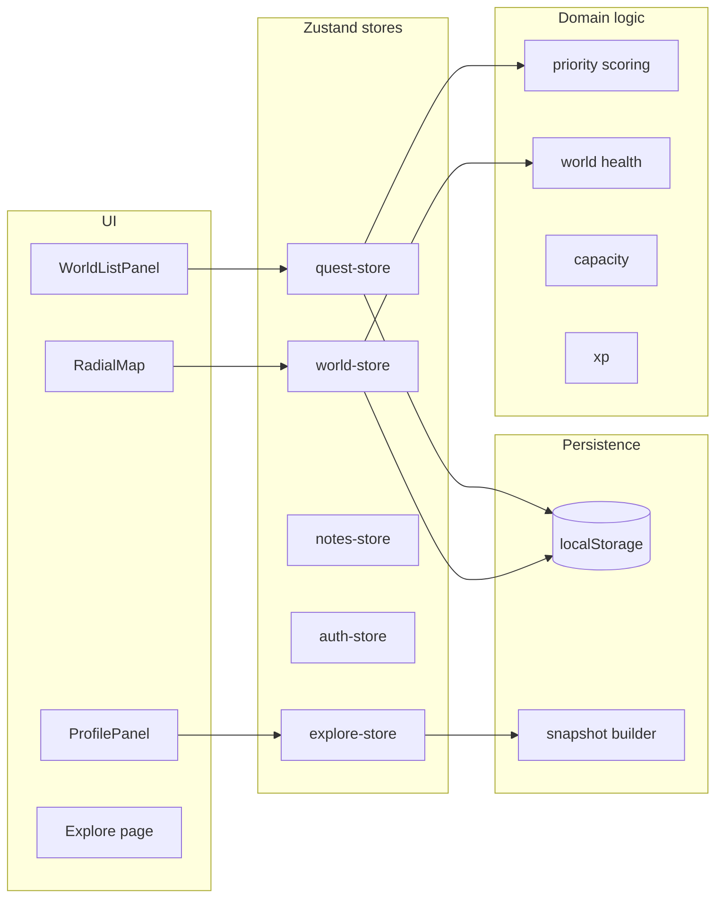

# QuestLoop

**A radial map of your worlds — see what to do next at a glance.**

QuestLoop is a personal planning app that organizes life into **worlds** (job search, fitness, family, creative work, and more). Each world gets a slice of an interactive radial map sized by importance. Hover to preview priorities; click to open tasks, notes, and next moves — without drowning in a flat to-do list.

---

## Features

| Area | What you get |
|------|----------------|
| **Radial map** | SVG-based home view with animated segments, tooltips, and a central pending-count hub |
| **Worlds & quests** | Create worlds with purpose, status, color, and importance; manage quests with due dates, estimates, and next moves |
| **Smart priority** | Weighted scoring from deadlines, importance, consequence, blocking value, neglect, and readiness |
| **World health** | Per-world health score from purpose clarity, next actions, activity, and allocation |
| **Notes** | Home and per-world notes in a slide-over panel |
| **Profile & explore** | Optional public map sharing; browse other people's published radial snapshots |
| **Guest mode** | Use the app immediately without signing in — data persists in the browser |
| **Gamification-ready** | XP constants, levels, focus sessions, rituals, and save points modeled in the domain layer |

---

## Quick start

### Prerequisites

- **Node.js** 20+
- **npm** (or pnpm / yarn / bun)

### Install & run

```bash
git clone https://github.com/your-org/QuestLoop.git
cd QuestLoop
npm install
npm run dev
```

Open [http://localhost:3000](http://localhost:3000). Create your first world from the header, or explore as a guest and sign in later.

### Environment variables

Copy the example file and fill in Supabase credentials when you wire up the backend:

```bash
cp .env.local.example .env.local
```

| Variable | Description |
|----------|-------------|
| `NEXT_PUBLIC_SUPABASE_URL` | Supabase project URL (local default: `http://127.0.0.1:54321`) |
| `NEXT_PUBLIC_SUPABASE_ANON_KEY` | Supabase anonymous key |
| `SUPABASE_SERVICE_ROLE_KEY` | Service role key (server-side only) |

The UI runs fully in **local-first** mode today: worlds, quests, and profile data live in `localStorage` keyed by account id. Supabase client helpers and SQL migrations are in place for cloud sync.

---

## Scripts

| Command | Description |
|---------|-------------|
| `npm run dev` | Start the Next.js dev server |
| `npm run build` | Production build |
| `npm run start` | Serve the production build |
| `npm run lint` | Run ESLint |
| `npm run test` | Run unit tests (Vitest) |
| `npm run test:watch` | Vitest in watch mode |
| `npm run test:e2e` | Playwright end-to-end tests |

---

## How it works



1. **Worlds** represent areas of life. Segment size on the map reflects importance; status (`PRIMARY`, `SECONDARY`, `MAINTENANCE`, `PAUSED`, `COMPLETED`) drives planning behavior.
2. **Quests** are actionable tasks inside a world. The priority engine ranks incomplete quests so “next moves” surface on hover and in the side panel.
3. **Account switching** loads a namespaced slice of `localStorage` per user id (`guest` when signed out). Sign-in is currently a mock Google flow; the auth store is designed to swap in `supabase.auth.signInWithOAuth`.
4. **Explore** publishes a read-only snapshot of your visible worlds when your profile is public. Snapshots update live while published.

---

## Project structure

```
QuestLoop/
├── src/
│   ├── app/                    # Next.js App Router (home, explore)
│   ├── components/
│   │   ├── radial-map/         # Map, world panel, add-world modal
│   │   ├── explore/            # Public map gallery
│   │   ├── auth/               # Sign-in UI
│   │   ├── profile/            # Sidebar profile & publish toggle
│   │   ├── notes/              # Notes panel
│   │   ├── settings/           # List display preferences
│   │   └── ui/                 # Shared primitives (Button, Card, …)
│   ├── domain/
│   │   ├── models/             # Pure domain helpers (e.g. world)
│   │   └── scoring/            # Priority, health, capacity, XP
│   ├── lib/
│   │   ├── stores/             # Zustand state
│   │   ├── supabase/           # Client & server Supabase helpers
│   │   ├── account.ts          # Per-account localStorage seam
│   │   ├── snapshot.ts         # Explore publish payloads
│   │   └── config.ts           # App constants & palette
│   └── types/                  # Domain types & enums
├── supabase/migrations/        # Postgres schema (auth, worlds, tasks, …)
└── tests/unit/                 # Vitest unit tests for scoring & models
```

---

## Database schema

Migrations under `supabase/migrations/` define the target Postgres model:

| Migration | Tables / concern |
|-----------|------------------|
| `001_auth_profile` | User profiles, avatar config, CORE guide state |
| `002_worlds` | Worlds |
| `003_task_hierarchy` | Objectives, campaigns, quests, rituals |
| `004_focus_sessions` | Focus sessions, save points, mission blocks |
| `005_inbox_waiting` | Inbox capture, waiting-for items |
| `006_weekly_planning` | Weekly plans, world allocations |

Apply these with the [Supabase CLI](https://supabase.com/docs/guides/cli) when you connect the app to a project.

---

## Tech stack

- [Next.js 16](https://nextjs.org/) · [React 19](https://react.dev/)
- [TypeScript](https://www.typescriptlang.org/)
- [Tailwind CSS 4](https://tailwindcss.com/)
- [Zustand](https://zustand.docs.pmnd.rs/) — client state & persistence
- [Framer Motion](https://www.framer.com/motion/) — panel & map animations
- [Supabase](https://supabase.com/) — auth & database (schema ready)
- [Vitest](https://vitest.dev/) — unit tests
- [Zod](https://zod.dev/) · [React Hook Form](https://react-hook-form.com/) — forms & validation

---

## Testing

Unit tests cover the scoring engine and domain models — the logic you want stable as the UI evolves:

```bash
npm run test
```

Tests live in `tests/unit/domain/` and run in jsdom via Vitest.

---

## Roadmap

QuestLoop is under active development. Notable next steps:

- Wire Zustand persistence to Supabase instead of `localStorage`
- Replace mock Google sign-in with Supabase OAuth
- Focus sessions, weekly planning UI, and inbox/waiting flows (schema exists)
- Optional XP and CORE guide surfaces in the UI

---

## Contributing

Issues and pull requests are welcome. Before opening a PR:

1. Run `npm run lint` and `npm run test`
2. Keep domain logic in `src/domain/` and out of components where possible
3. Match existing naming (`World`, `Quest`, `WorldStatus`, etc.)

---

<p align="center">
  <sub>Built for people juggling many worlds — one map to see them all.</sub>
</p>
